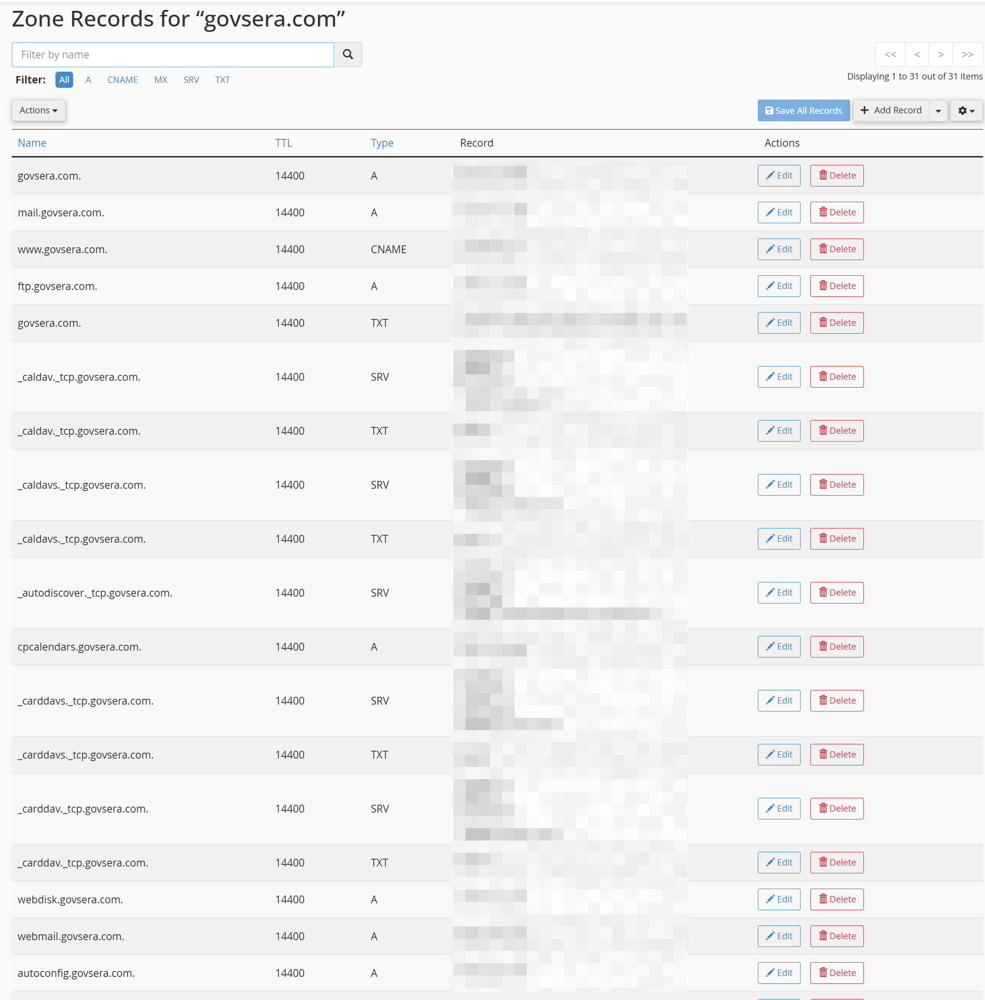
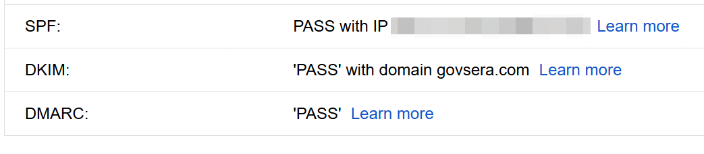
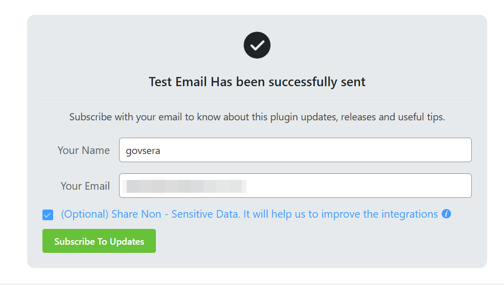
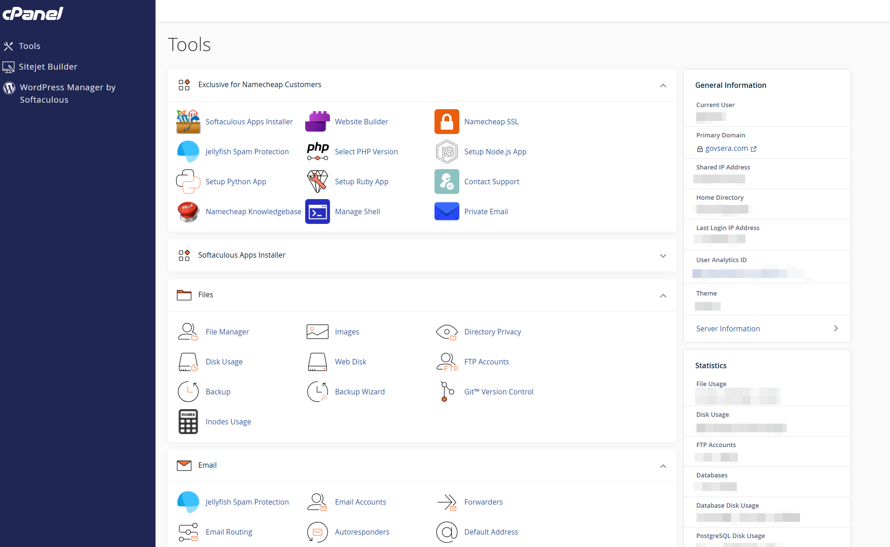

<h1>Technical Systems & Infrastructure</h1>

>  🔒 Some information has been redacted to protect confidentiality and security.

The Govsera project required the configuration of core technical systems to connect the domain, website, and business email into a stable and functional environment. The focus was on ensuring proper domain resolution, reliable email delivery, and secure system integration across all components.

<h2>Domain & DNS Configuration</h2>

The domain was managed through GoDaddy, with DNS records configured and maintained within the Namecheap hosting environment. Key records, including A records, CNAME records, and MX records, were set and verified to ensure accurate routing between the domain and hosting services.

This configuration enabled proper website loading, supported email routing, and satisfied domain verification requirements across connected platforms.

> DNS configuration showing domain routing and email authentication records.
 
<h2> Email Authentication (SPF, DKIM, DMARC)</h2>

Full email authentication was implemented to improve deliverability and establish sender credibility. This included the configuration of SPF, DKIM, and DMARC records.

<ul>
<li>SPF authorized Microsoft 365 as a valid sending source</li>
<li>DKIM was enabled and validated through published CNAME records</li>
<li>DMARC was configured to define policy and improve trust with receiving servers</li>
</ul>

These configurations help prevent spoofing, reduce the likelihood of emails being marked as spam, and support consistent delivery.

> Email authentication successfully validated during delivery
 
<h2>Microsoft 365 / Outlook Email Setup</h2>

Microsoft 365 was configured to manage business email using the custom domain. This process included domain verification, mailbox setup, and integration between DNS records and Microsoft services.

Sender identity settings were also adjusted to ensure that outgoing emails reflected a consistent and professional business name.
 

<h2>SMTP Configuration & Email Troubleshooting</h2>

SMTP was configured to handle outbound email from the website, with additional troubleshooting required to resolve initial delivery issues.

This included:
<ul>
<li>Resolving SMTP authentication errors</li>
<li>Verifying DNS propagation and record accuracy</li>
<li>Testing email headers to confirm SPF, DKIM, and DMARC pass status</li>
<li>Ensuring emails were successfully delivered without being flagged or rejected</li>
</ul>

These steps resulted in a stable and reliable email delivery system.
 

> Email delivery validation and SMTP troubleshooting results.
 
<h2>Hosting Environment & SSL Configuration</h2>

The hosting environment was managed through Namecheap cPanel. Core configurations were applied to support security, performance, and compatibility.

This included:

<ul>
<li>Enabling SSL to ensure secure HTTPS connections</li>
<li>Managing PHP versions for performance and system compatibility</li>
<li>Supporting overall site stability through hosting-level configuration</li>
</ul>
 

> cPanel dashboard
 

<h2>Professional Takeaway</h2>

A functional website depends on more than front-end development. Proper domain configuration, DNS management, email authentication, and hosting setup (along with other facters) are critical to ensuring reliability, security, and professional operation.

The result is a fully integrated system in which the website, domain, and email infrastructure operate together without conflict or delivery issues.

[Return to Home](https://github.com/JorgeFSantillan)
